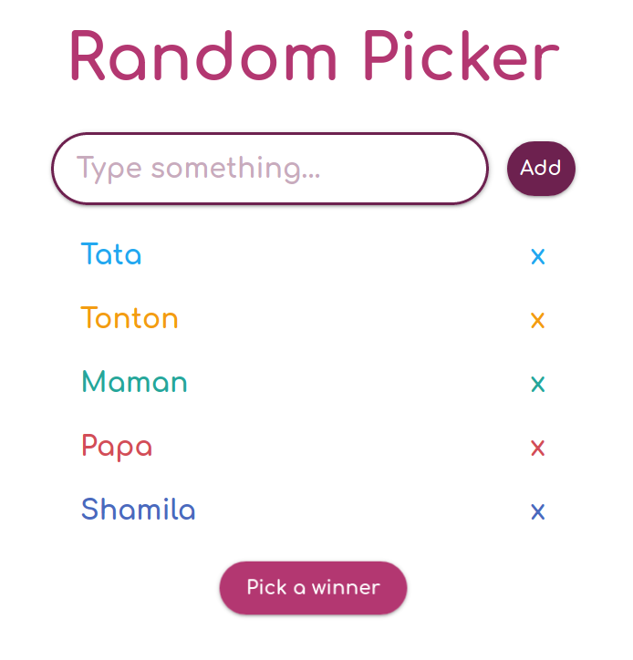

# Random Picker

  

Make a list and pick a winner randomly !  
A web app made with React.

## Installation

#### `npm install` or `yarn`

#### `npm start` or `yarn start`

Runs the app in the development mode.

Open [http://localhost:3000](http://localhost:3000) to view it in the browser.

## Build the app

#### `npm run build` or `yarn run build`

Builds the app for production to the `build` folder.
